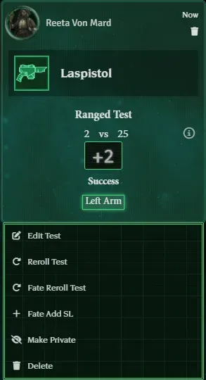
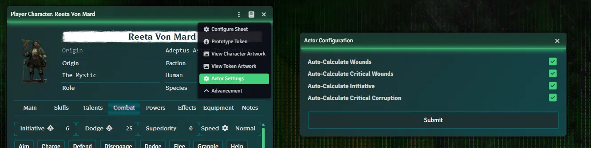
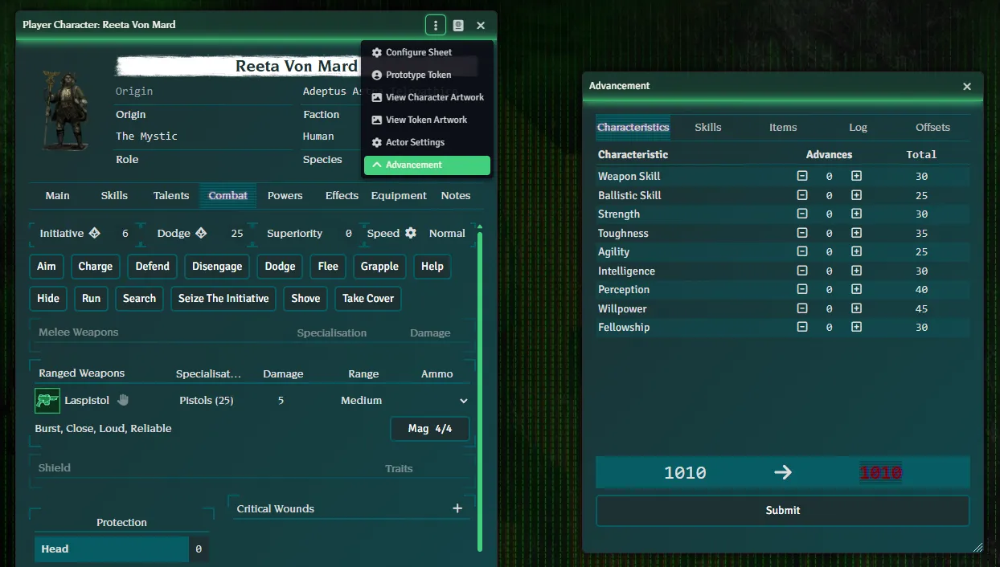

{: .warning}
While this covers the basics of using this system, it still assumes you know the basics of Foundry first. These concepts include most notably how Actors and Items and Effects interact with each other. You can find more information about basic Foundry concepts in the [Knowledge Base](https://foundryvtt.com/kb/).

{:toc}

## General Topics

Below are topics that should be known when using the system and can be described briefly. Topics that require more in-depth descriptions are given dedicated sub-pages.

### Test Context Menu Options

Like many other things in Foundry, right clicking a Test in chat provides many useful options that every user should know about.

### Actor Settings

The Actor Settings menu lets you configure automated behavior within the Actor, namely disabling automatic calculations. Here you can disabling automatic max wound calculation, encumbrance calculation, token sizing, and more. 

### Advancement

Spending XP on Characteristics and Skills is done in a separate window, accessed via the top of the sheet.

### Theme Configuration

You can modify the system's styling of Foundry to suit your personal taste and needs. To do so, simply navigate to the System Settings and open the Theme Configuration window. 

Here you can choose to disable the Theme in specific areas, or use a more readable (sans-serif) font.

{: .important}
This is a client specific setting, so whatever you choose only applies to you!
